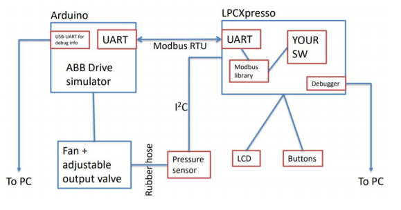
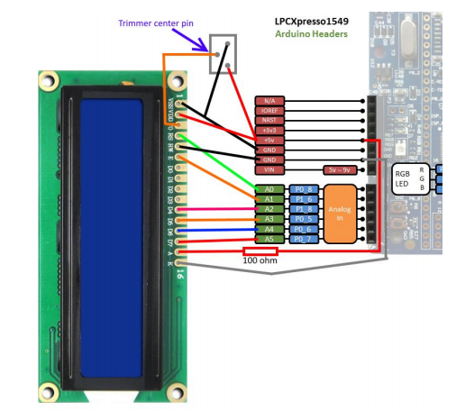
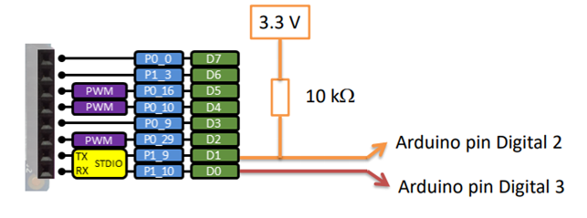

# ABB-Modbus-project
Ventilation system with an automatic and manual mode using LPC 1549

Projects idea was to create a ventilation system to control the pressure and airflow inside a pipe

The ventilation fan is connected to a ABB frequency converter and the converter is controlled using Modbud protocol

The system has two operating modes:

Automatic; you can set the pressure level in the ventilation duct to  0 - 120 pa
Controller measures pressure level and keeps the level at requied setting by adjusting the fan speed
If required level can’t be reached within a reasonable time user is notified on the UI

Manual; set the speed of the fan in UI (0 - 100%) Displays the current fans setting and pressure level

Wiring Diagram

